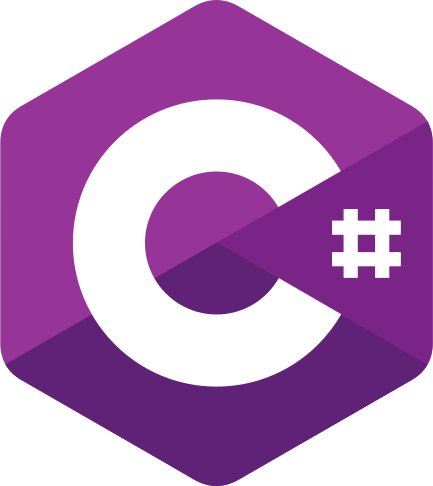

# Droid
***Disclaimer: This repository is actively under development! Expect defective features.***

Droid is a unity package that enables prototyping reinforcement learning environments within the [Unity](https://unity3d.com/) engine and communication to the [Neo](https://github.com/sintefneodroid/neo) counterpart of the [Neodroid](https://github.com/sintefneodroid) platform.

<table>
  <tr>
    <td>
      <a href='https://travis-ci.org/sintefneodroid/droid'>
        
      </a>
    </td>
    <td>
      <a href='https://coveralls.io/github/sintefneodroid/droid?branch=master'>
        
      </a>
    </td>
    <td>
      <a href='https://github.com/sintefneodroid/droid/issues'>
        
      </a>
    </td>
    <td>
      <a href='https://github.com/sintefneodroid/droid/network'>
        
      </a>
    </td>
      <td>
      <a href='https://github.com/sintefneodroid/droid/stargazers'>
        
      </a>
    </td>
      <td>
      <a href='https://github.com/sintefneodroid/droid/blob/master/LICENSE.md'>
        
      </a>
    </td>
  </tr>
</table>

<p align="center" width="100%">
  <a href="https://unity3d.com/">
    
  </a>
  <a href="https://docs.microsoft.com/en-us/dotnet/csharp/index">
    
  </a>
  <a href="https://github.com/zeromq/netmq">
    
  </a>
</p>
<p align="center" width="100%">
  <a href="https://github.com/google/flatbuffers">
    
  </a>
</p>

This project has similarities with Unity's own project [Unity Machine Learning Agents](https://github.com/Unity-Technologies/ml-agents). Most of the efforts done in this project were made prior to their announcement, [Introducing: Unity Machine Learning Agents](https://blogs.unity3d.com/2017/09/19/introducing-unity-machine-learning-agents/), when the authors was in need of a capable tool. Newcomers wanting a more supported experience may wish to use the [Unity Machine Learning Agents](https://github.com/Unity-Technologies/ml-agents) project instead.

The entire Neodroid platform serves as a tool for academic research specific to the authors interests, hence explaining the existence and future direction of this project.

## Usage

- Download the newest Droid.unitypackage from [releases](https://github.com/sintefneodroid/droid/releases) and import into your Unity project.

***Or***

- Acquire the [Droid (Temporarily down)](http://u3d.as/14cC) package from the built-in asset store of the Unity Editor.

## Screenshots


## Repository Structure
---
<!--    ├  └  ─  │   -->
    sintefneodroid/droid      # This repository
    │
    ├── docs                
    │   ├── source            # Documentation files
    │   │
    │   ├── make.bat          # Compile docs
    │   └── Makefile          # ^
    │       
    ├── Examples              # Prebuilt Neodroid environments
    │   ├── Assets            # Model checkpoints
    │   │   ├── Neodroid      # Symlinked folder to top-level Neodroid folder
    │   │   ├── SceneAssets   # All scene-specific assets for the prebuilt environments
    │   │   └── Scenes        # All prebuilt environment scenes
    │   │
    │   └── Examples.sln      # C# project file
    │
    ├── RepoAssets            # Images and such for this README
    │
    ├── Neodroid              # The Neodroid unity package
    │   ├── Prototyping       # All classes for quick prototyping of observations and actions
    │   │   ├── Actors        
    │   │   ├── Evaluation    
    │   │   ├── Observers     
    │   │   ├── Displayers    
    │   │   ├── Configurables
    │   │   └── Motors        
    │   │
    │   ├── Environments      # Classes for encapsulating all Neodroid environments
    │   ├── Managers          # Classes for managing the simulation of Neodroid environments
    │   └── Utilities         # Lots of helper functionalities
    │   
    ├── LICENSE               # License file (Important but boring)
    └── README.md             # The top-level README
---

## Quick Development Setup
1. ```git clone https://github.com/sintefneodroid/droid```
2. Remember to checkout lfs files as well
3. Open the ```Examples``` folder as a Unity project

### Important Notice for **Windows** Users!
Run ```fix_windows_symlink.bat``` with administrative privileges, to make Windows recognise the Neodroid symlink in the Unity project of this repository. If on any other platform you should be fine.

# Other Components Of The Neodroid Platform
- [agent](https://github.com/sintefneodroid/agent)
- [neo](https://github.com/sintefneodroid/neo)
